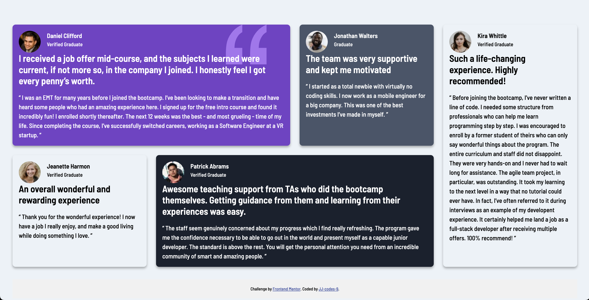

# Frontend Mentor - Testimonials grid section solution

This is a solution to the [Testimonials grid section challenge on Frontend Mentor](https://www.frontendmentor.io/challenges/testimonials-grid-section-Nnw6J7Un7). Frontend Mentor challenges help you improve your coding skills by building realistic projects. 

## Table of contents

- [Overview](#overview)
  - [The challenge](#the-challenge)
  - [Screenshot](#screenshot)
  - [Links](#links)
- [My process](#my-process)
  - [Built with](#built-with)
  - [What I learned](#what-i-learned)
  - [Continued development](#continued-development)
- [Author](#author)


## Overview

### The challenge

Users should be able to:

- View the optimal layout for the site depending on their device's screen size

### Screenshot



This is a screenshot of the final design, showcasing the responsive layout for desktop and mobile views. I used Chrome's Developer Tools to simulate mobile devices and verify the responsiveness of the grid.

### Links

- Solution URL: [Here is my solution on Front End Mentor](https://www.frontendmentor.io/solutions/testimonials-grid-section-solution-DTHeg4_pi1)
- Live Site URL: [Here is the live site deployed on GitHub](https://jj-codes-9.github.io/testimonials-grid-section-main/)

## My process

### Built with

- Semantic HTML5 markup
- CSS custom properties
- CSS Grid
- Mobile-first workflow
- Media queries for responsiveness


### What I learned

This challenge helped me solidify my understanding of CSS Grid and how to structure content in a grid format. 

Code snippets:
Here is an example of how I structured the grid:

```.testimonial-grid {
  display: grid;
  gap: 1.5rem;
  grid-template-columns: repeat(4, 1fr);
  max-width: 80%;
  margin: 2rem auto;
}
```


### Continued development

In future projects, I want to explore:

- Using CSS Grid for more complex layouts
- Improving accessibility by focusing on ARIA roles and semantic HTML
- Optimizing responsive designs for tablet screens, as it's often overlooked compared to mobile and desktop


## Author

- Website - [JJ-codes-9](https://www.jjatwork.com)
- Frontend Mentor - [@jj-codes-9](https://www.frontendmentor.io/profile/JJ-codes-9)

